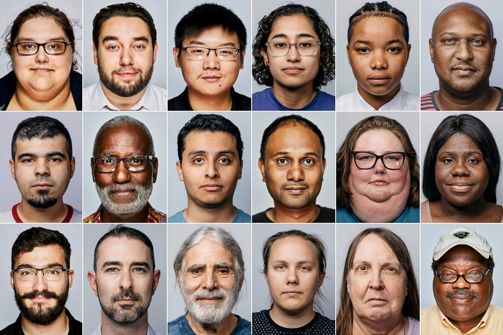
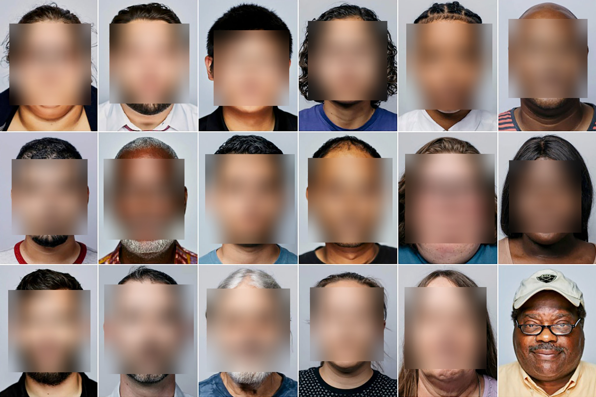

# Redactor
censor personal data such as faces in a photo or video

----

This programme uses OpenCV to process an image to blur out faces

----

## Image Input

## Image Output

ps I think OpenCV thought the uncle on the bottom right was way to beutiful and couldnt disrespect him by blurring his face.